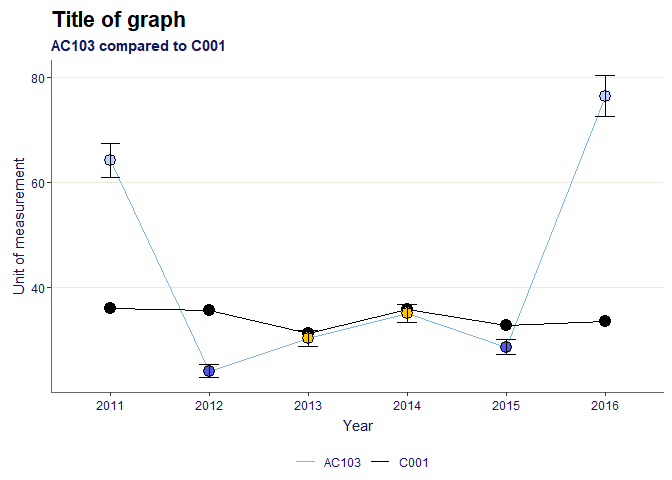
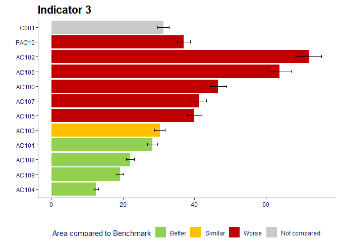

<!-- README.md is generated from README.Rmd. Please edit that file -->

[](https://travis-ci.org/PublicHealthEngland/fingertipscharts)
[](https://coveralls.io/github/PublicHealthEngland/fingertipscharts?branch=master)

[](https://cran.r-project.org/package=fingertipscharts)
[](https://cran.r-project.org/package=fingertipscharts)
[](https://cran.r-project.org/package=fingertipscharts)

# fingertipscharts

This is an R package to help users to easily reproduce charts that are
displayed on Public Health England’s
[Fingertips](http://fingertips.phe.org.uk/) data tool. Along with the
`fingertipsR` package, this package can be used to help users bring the
data on the website into their own outputs.

## Installation

### CRAN

Get the latest released, stable version from CRAN:

``` r
install.packages("fingertipscharts")
```

### With devtools

You can install the latest development version from github using
[devtools](https://github.com/hadley/devtools):

``` r
# install.packages("devtools")
devtools::install_github("PublicHealthEngland/fingertipscharts",
                         build_vignettes = TRUE)
```

### From zip

Download this repository from GitHub and either build from source or do
the following, that also requires
[devtools](https://github.com/hadley/devtools):

``` r
source <- devtools:::source_pkg("C:/path/to/fingertipscharts-master")
install(source)
```

### Base R instructions

To install the package without the use of CRAN or
[devtools](https://github.com/hadley/devtools), download the `.tar.gz`
file and then run:

``` r
install.packages(path_to_file, repos = NULL, type="source")
```

Where `path_to_file` would represent the full path and file name.

## Example of some visualisations

Here are a couple of example visualisations the package provides. See
the vignettes for a more comprehensive overview.

### Trends

``` r
library(fingertipsR)
library(fingertipscharts)
library(dplyr)
df <- fingertips_data(90366) %>%
          filter(Sex == "Male")
p <- trends(df,
            timeperiod = Timeperiod,
            value = Value,
            area = AreaName,
            comparator = "England",
            area_name = "Cambridgeshire",
            fill = ComparedtoEnglandvalueorpercentiles,
            lowerci = LowerCI95.0limit,
            upperci = UpperCI95.0limit,
            title = "Life expectancy at birth",
            subtitle = "Cambridgeshire compared to England",
            xlab = "Year",
            ylab = "Age (years)")
p
```

<!-- -->

### Compare indicators

``` r
library(tidyr)
df <- fingertips_data(c(90362, 90366)) %>%
        group_by(IndicatorID) %>%
        filter(Timeperiod == "2014 - 16" &
                       Sex == "Male") %>%
        ungroup() %>%
        select(IndicatorID, AreaName, Value) %>%
        mutate(IndicatorID = paste0("x", IndicatorID)) %>%
        spread(IndicatorID, Value)
p <- compare_indicators(df,
                        x = x90362,
                        y = x90366,
                        xlab = "Healthy life expectancy at birth",
                        ylab = "Life expectancy at birth",
                        highlight_area = c("England", "Dorset"),
                        area = AreaName,
                        add_R2 = TRUE)
p
```

<!-- -->
